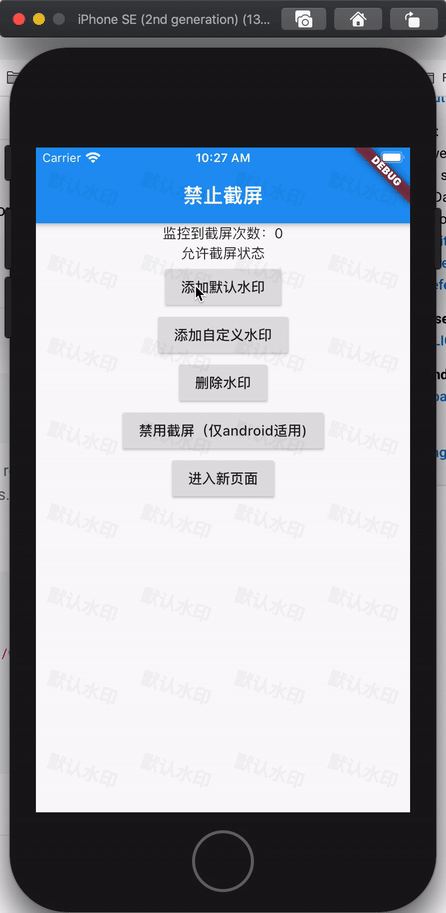

# disable_screenshots

在Flutter开发中，有时我们需要对App的内容进行管控，避免敏感信息暴露，所以开发了这个插件。此插件提供三个禁用截屏的相关功能，分别是：`截屏监控行为`、`全局添加水印`、`禁用截屏（仅支持Android）`。

## Getting Started

### Add dependency
```
dependencies:
  disable_screenshots: 0.0.1 #latest version
```

### 功能演示


### 使用样例
```dart
class RootApp extends StatefulWidget {
  @override
  _RootAppState createState() => _RootAppState();
}

class _RootAppState extends State<RootApp> {
  // 初始化插件
  DisableScreenshots _plugin = DisableScreenshots();
  // 监控截屏行为的stream
  StreamSubscription<void> _screenshotsSubscription;
  int _screenshotsCount = 0;
  bool _disableScreenshots = false;

  @override
  void initState() {
    super.initState();
    _screenshotsSubscription = _plugin.onScreenShots.listen((event) {
      setState(() {
        _screenshotsCount++;
      });
    });
  }

  @override
  Widget build(BuildContext context) {
    return Scaffold(
      appBar: AppBar(
        title: const Text('禁止截屏'),
      ),
      body: Column(
        children: <Widget>[
          Center(
            child: Text("监控到截屏次数：$_screenshotsCount"),
          ),
          Center(
            child: Text(_disableScreenshots ? "禁止截屏状态" : "允许截屏状态"),
          ),
          RaisedButton(
              onPressed: () {
                // 添加默认样式的水印
                _plugin.addWatermark(context, "默认水印",
                    rowCount: 4, columnCount: 8);
              },
              child: Text("添加默认水印")),
          RaisedButton(
              onPressed: () {
                // 添加自定义widget当做水印
                _plugin.addCustomWatermark(context,
                    Watarmark(rowCount: 3, columnCount: 10, text: "自定义水印"));
              },
              child: Text("添加自定义水印")),
          RaisedButton(
              onPressed: () {
                // 移除水印
                _plugin.removeWatermark();
              },
              child: Text("删除水印")),
          RaisedButton(
              onPressed: () async {
                bool flag = !_disableScreenshots;
                // 禁用或允许截屏（只支持iOS）
                await _plugin.disableScreenshots(flag);
                setState(() {
                  _disableScreenshots = flag;
                });
              },
              child: Text(_disableScreenshots ? "允许截屏（仅android适用）" : "禁用截屏（仅android适用)")),
          RaisedButton(
              onPressed: () {
                Navigator.of(context).push(MaterialPageRoute(
                    builder: (_) => Scaffold(
                          appBar: AppBar(
                            title: Text("我是新页面"),
                          ),
                          body: Center(child: Text("new page")),
                        )));
              },
              child: Text("进入新页面"))
        ],
      ),
    );
  }

  @override
  void dispose() {
    super.dispose();
    //取消截屏监控可以调用cancel()方法
    if (_screenshotsSubscription != null) {
      _screenshotsSubscription.cancel();
    }
  }
}
```

### 已知问题
1. 在老的flutter项目中，在iOS平台运行可能出现编译问题无法运行。这个是由于老的flutter项目里面没有使用到swift，所以没有briging文件，但是插件使用了swift，所以会编译失败，这种情况直接使用xcode在iOS项目中创建一个swift文件，会自动生成briding文件。
